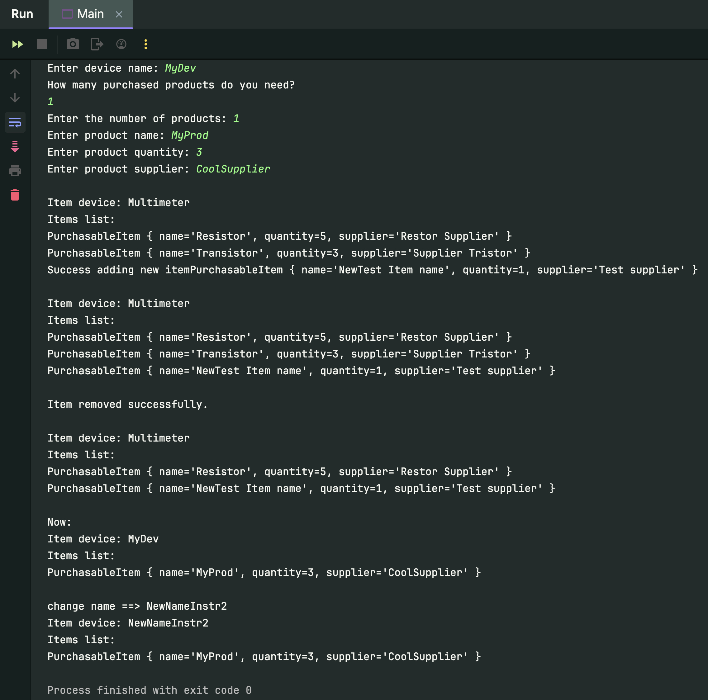

# Лабораторна робота №2 Класи у мові Java

## Завдання:

## Мета лабораторної роботи –
Придбання навичок практичної роботи з класами на мові


## Виконання лабораторної роботи

Створити клас «Вимірювальний прилад» у відповідності з завданням.

### Передбачити:
- два конструктора ( перший – з параметрами, другий - приймає значення даних в діалоговому режимі);
- методи зміни та отримання даних, що представляють властивості приладу;
- методи, що керують станом приладу.
- Створити кілька об'єктів класу. Запрограмувати роботу з об'єктами з застосуванням усіх методів класу.


### Варіант завдання 1

Вихідні дані для лабораторної роботи
Заводом випускаються різні вимірювальні прилади. Кожен прилад може
характеризуватися наведеними нижче даними.

Характеристики приладів, що реалізуються у варіантах завдань.

1. Найменування приладу.
9. Покупні вироби (деталі та матеріали, які цим заводом не виготовляються, а купуються
   у інших виробників). Для виготовлення кожного приладу може знадобитися кілька покупних
   виробів. Кожен з них характеризується:
   - назвою;
   - кількістю;
   - назвою постачальника.

## Висновок: 
На цій лабораторній роботі, було вперше придбано навички практичної роботи з класами на мові Java. У відповідності з завданням стоврено два класи: MeasuringDevice та PurchasableItem.
- Передбачено:
    - два конструктора ( перший – з параметрами, другий - приймає значення даних в діалоговому режимі);
    - методи зміни та отримання даних, що представляють властивості приладу;
    - методи, що керують станом приладу.
    - Створено кілька об'єктів класу. Запрограмувано роботу з об'єктами з застосуванням усіх методів класу.


**З таким вмістом в Main:**
```java
import java.util.ArrayList;

public class Main {
    public static void main(String[] args) {

        ArrayList<PurchasableItem> itemsList = new ArrayList<>();
        itemsList.add(new PurchasableItem("Resistor", 5, "Restor Supplier"));
        itemsList.add(new PurchasableItem("Transistor",3, "Supplier Tristor"));

        MeasuringDevice measurInstrument1 = new MeasuringDevice("Multimeter", itemsList);
        MeasuringDevice measurInstrument2 = new MeasuringDevice();

        System.out.println();
        measurInstrument1.displayDeviceInfo();

        measurInstrument1.addNewItem(new PurchasableItem("NewTest Item name", 1, "Test supplier"));
        System.out.println();
        measurInstrument1.displayDeviceInfo();
        System.out.println();

        measurInstrument1.removeItem(1);
        System.out.println();
        measurInstrument1.displayDeviceInfo();
        System.out.println();

        System.out.println("Now:");
        measurInstrument2.displayDeviceInfo();
        System.out.println();

        System.out.println("change name ==> NewNameInstr2");
        measurInstrument2.setDeviceName("NewNameInstr2");
        measurInstrument2.displayDeviceInfo();
    }
}
```

**Результат:**

